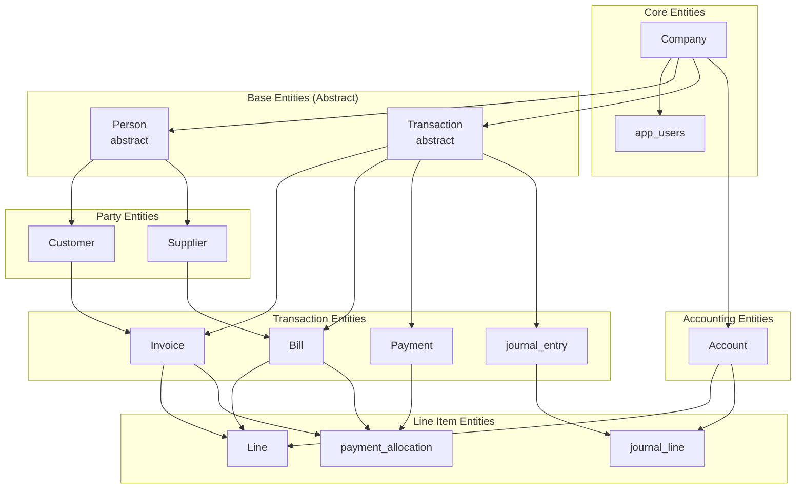
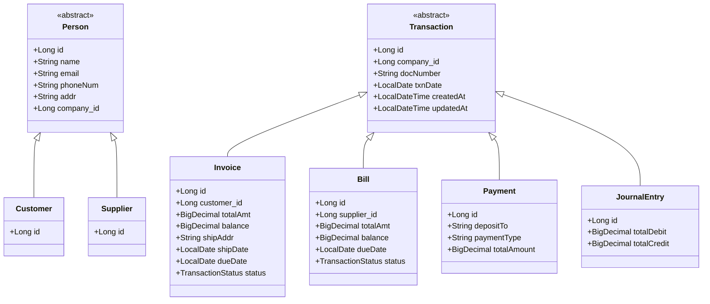
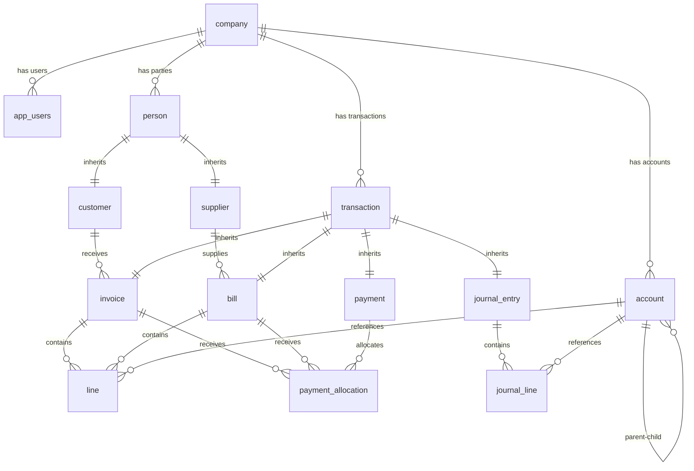

# Design Document: Database Schema Documentation

## Overview

This document provides a comprehensive technical reference for the established PostgreSQL database schema in the public schema. The schema supports a multi-tenant accounting application built with Spring Boot, featuring Firebase authentication, double-entry bookkeeping, accounts receivable (AR), accounts payable (AP), and payment management capabilities.

The schema follows a hierarchical design with inheritance patterns for core entities (Person, Transaction) and implements company-based multi-tenancy with lazy loading and batch optimization strategies.

## Architecture

### High-Level Schema Architecture



### Table Inheritance Strategy

The schema uses JPA/Hibernate JOINED inheritance strategy for polymorphic entities:



## Components and Interfaces

### Entity: Company

**Purpose**: Represents a tenant in the multi-tenant system. All business entities are scoped to a company.

**Table**: `company`

| Column | Type | Constraints | Description |
|--------|------|-------------|-------------|
| id | BIGINT | PRIMARY KEY, AUTO_INCREMENT | Unique identifier |
| name | VARCHAR | - | Company name |
| email | VARCHAR | - | Company email |
| phoneNumber | VARCHAR | - | Contact phone |
| addr | VARCHAR | - | Address |

**Relationships**:
- One-to-Many with `app_users` (users)
- One-to-Many with `person` (parties)
- One-to-Many with `transaction` (all transactions)
- One-to-Many with `account` (chart of accounts)

---

### Entity: app_users

**Purpose**: Application users with Firebase authentication integration. Supports role-based access control.

**Table**: `app_users`

| Column | Type | Constraints | Description |
|--------|------|-------------|-------------|
| id | BIGINT | PRIMARY KEY, AUTO_INCREMENT | Unique identifier |
| firebase_uid | VARCHAR(128) | UNIQUE, NOT NULL | Firebase Auth UID |
| role | VARCHAR(32) | NOT NULL, DEFAULT 'STAFF' | User role (SUPER_ADMIN, ADMIN, STAFF) |
| name | VARCHAR | - | User display name |
| email | VARCHAR | - | User email |
| phoneNumber | VARCHAR | - | User phone |
| addr | VARCHAR | - | User address |
| company_id | BIGINT | FOREIGN KEY → company | Company association |

**Indexes**:
- `uk_app_users_firebase_uid` - Unique constraint on Firebase UID

**Relationships**:
- Many-to-One with `company`

---

### Entity: Account

**Purpose**: Chart of accounts with hierarchical structure supporting double-entry bookkeeping.

**Table**: `account`

| Column | Type | Constraints | Description |
|--------|------|-------------|-------------|
| id | BIGINT | PRIMARY KEY, AUTO_INCREMENT | Unique identifier |
| accountCode | VARCHAR | - | Account code (e.g., "1000", "2000") |
| name | VARCHAR | - | Account name |
| accountType | VARCHAR | NOT NULL | Account type (ASSET, LIABILITY, EQUITY, REVENUE, EXPENSE) |
| isActive | BOOLEAN | DEFAULT TRUE | Active status flag |
| parent_id | BIGINT | FOREIGN KEY → account | Parent account for hierarchy |
| company_id | BIGINT | FOREIGN KEY → company | Company association |
| created_at | TIMESTAMP | - | Record creation timestamp |
| updated_at | TIMESTAMP | - | Last update timestamp |
| created_by | BIGINT | - | User ID who created the record |

**Relationships**:
- Many-to-One with `account` (self-referential for parent)
- One-to-Many with `account` (children accounts)
- Many-to-One with `company`

**Business Rules**:
- Hierarchical structure enables account grouping and reporting
- Account types follow standard accounting equation: Assets = Liabilities + Equity
- Supports filtering by company through Hibernate filters

---

### Entity: Person (Abstract)

**Purpose**: Base entity for party types (Customer, Supplier). Implements company-scoped multi-tenancy.

**Table**: `person`

| Column | Type | Constraints | Description |
|--------|------|-------------|-------------|
| id | BIGINT | PRIMARY KEY, AUTO_INCREMENT | Unique identifier |
| name | VARCHAR | - | Party name |
| email | VARCHAR | - | Email address |
| phoneNum | VARCHAR | - | Phone number |
| addr | VARCHAR | - | Address |
| company_id | BIGINT | FOREIGN KEY → company | Company association |
| dtype | VARCHAR | Discriminator column | Entity type (Customer/Supplier) |

**Inheritance**: JOINED strategy with discriminator column

---

### Entity: Customer

**Purpose**: Customer entity for accounts receivable. Inherits from Person.

**Table**: `customer`

| Column | Type | Constraints | Description |
|--------|------|-------------|-------------|
| id | BIGINT | PRIMARY KEY, FOREIGN KEY → person | Inherits from Person |

**Relationships**:
- One-to-Many with `invoice` (customer invoices)

---

### Entity: Supplier

**Purpose**: Supplier/Vendor entity for accounts payable. Inherits from Person.

**Table**: `supplier`

| Column | Type | Constraints | Description |
|--------|------|-------------|-------------|
| id | BIGINT | PRIMARY KEY, FOREIGN KEY → person | Inherits from Person |

**Relationships**:
- One-to-Many with `bill` (supplier bills)

---

### Entity: Transaction (Abstract)

**Purpose**: Base entity for all transaction types. Provides common document tracking and audit fields.

**Table**: `transaction`

| Column | Type | Constraints | Description |
|--------|------|-------------|-------------|
| id | BIGINT | PRIMARY KEY, AUTO_INCREMENT | Unique identifier |
| company_id | BIGINT | FOREIGN KEY → company | Company association |
| docNumber | VARCHAR | - | Document number (invoice #, bill #, etc.) |
| txnDate | DATE | - | Transaction date |
| created_at | TIMESTAMP | - | Record creation timestamp |
| updated_at | TIMESTAMP | - | Last update timestamp |
| dtype | VARCHAR | Discriminator column | Entity type (Invoice/Bill/Payment/JournalEntry) |

**Inheritance**: JOINED strategy with discriminator column

---

### Entity: Invoice

**Purpose**: Sales invoice for accounts receivable. Supports payment tracking and status management.

**Table**: `invoice`

| Column | Type | Constraints | Description |
|--------|------|-------------|-------------|
| id | BIGINT | PRIMARY KEY, FOREIGN KEY → transaction | Inherits from Transaction |
| customer_id | BIGINT | FOREIGN KEY → customer | Customer reference |
| totalAmt | DECIMAL(19,2) | - | Total invoice amount |
| balance | DECIMAL(19,2) | - | Outstanding balance |
| shipAddr | VARCHAR | - | Shipping address |
| shipDate | DATE | - | Shipping date |
| dueDate | DATE | - | Payment due date |
| status | VARCHAR | - | Status (UNPAID, PARTIALLY_PAID, PAID, OVERDUE) |

**Relationships**:
- Many-to-One with `customer`
- One-to-Many with `line` (line items)
- One-to-Many with `payment_allocation` (payment allocations)

**Business Rules**:
- balance = totalAmt - sum(allocated payments)
- Status transitions: UNPAID → PARTIALLY_PAID → PAID
- OVERDUE status set by scheduled job when dueDate passed and balance > 0

---

### Entity: Bill

**Purpose**: Supplier bill for accounts payable. Supports payment tracking and status management.

**Table**: `bill`

| Column | Type | Constraints | Description |
|--------|------|-------------|-------------|
| id | BIGINT | PRIMARY KEY, FOREIGN KEY → transaction | Inherits from Transaction |
| supplier_id | BIGINT | FOREIGN KEY → supplier | Supplier reference |
| totalAmt | DECIMAL(19,2) | - | Total bill amount |
| balance | DECIMAL(19,2) | - | Outstanding balance |
| dueDate | DATE | - | Payment due date |
| status | VARCHAR | - | Status (UNPAID, PARTIALLY_PAID, PAID, OVERDUE) |

**Relationships**:
- Many-to-One with `supplier`
- One-to-Many with `line` (line items)
- One-to-Many with `payment_allocation` (payment allocations)

**Business Rules**:
- Same status and balance tracking as Invoice

---

### Entity: Payment

**Purpose**: Payment record for both accounts receivable and accounts payable.

**Table**: `payment`

| Column | Type | Constraints | Description |
|--------|------|-------------|-------------|
| id | BIGINT | PRIMARY KEY, FOREIGN KEY → transaction | Inherits from Transaction |
| depositTo | VARCHAR | - | Deposit account reference |
| paymentType | VARCHAR | - | Payment type/method |
| totalAmount | DECIMAL(19,2) | - | Total payment amount |

**Relationships**:
- One-to-Many with `payment_allocation` (allocations to invoices/bills)

---

### Entity: JournalEntry

**Purpose**: Double-entry bookkeeping journal entry. Maintains debit/credit balance.

**Table**: `journal_entry`

| Column | Type | Constraints | Description |
|--------|------|-------------|-------------|
| id | BIGINT | PRIMARY KEY, FOREIGN KEY → transaction | Inherits from Transaction |
| totalDebit | DECIMAL(19,2) | - | Sum of all debit lines |
| totalCredit | DECIMAL(19,2) | - | Sum of all credit lines |

**Relationships**:
- One-to-Many with `journal_line` (journal lines)

**Business Rules**:
- totalDebit MUST EQUAL totalCredit (double-entry constraint)
- Each journal line must have either debit OR credit (not both, not neither)

---

### Entity: Line

**Purpose**: Line item for Invoice and Bill transactions.

**Table**: `line`

| Column | Type | Constraints | Description |
|--------|------|-------------|-------------|
| id | BIGINT | PRIMARY KEY, AUTO_INCREMENT | Unique identifier |
| lineNum | INT | - | Line sequence number |
| description | VARCHAR | - | Line description |
| quantity | DECIMAL(19,4) | - | Quantity |
| unitPrice | DECIMAL(19,2) | - | Unit price |
| amount | DECIMAL(19,2) | - | Line amount (quantity × unitPrice) |
| account_id | BIGINT | FOREIGN KEY → account | Account reference |
| transaction_id | BIGINT | FOREIGN KEY → transaction | Parent transaction |

**Relationships**:
- Many-to-One with `transaction` (Invoice or Bill)
- Many-to-One with `account`

---

### Entity: JournalLine

**Purpose**: Individual debit/credit line in a journal entry.

**Table**: `journal_line`

| Column | Type | Constraints | Description |
|--------|------|-------------|-------------|
| id | BIGINT | PRIMARY KEY, AUTO_INCREMENT | Unique identifier |
| lineNum | INT | - | Line sequence number |
| description | VARCHAR | - | Line description |
| debit | DECIMAL(19,2) | DEFAULT 0 | Debit amount |
| credit | DECIMAL(19,2) | DEFAULT 0 | Credit amount |
| account_id | BIGINT | FOREIGN KEY → account | Account reference |
| journal_entry_id | BIGINT | FOREIGN KEY → journal_entry | Parent journal entry |

**Relationships**:
- Many-to-One with `journal_entry`
- Many-to-One with `account`

**Business Rules**:
- Either debit > 0 OR credit > 0 (exclusive)
- Cannot have both debit and credit on same line

---

### Entity: PaymentAllocation

**Purpose**: Links payments to invoices (AR) or bills (AP), tracking payment application.

**Table**: `payment_allocation`

| Column | Type | Constraints | Description |
|--------|------|-------------|-------------|
| id | BIGINT | PRIMARY KEY, AUTO_INCREMENT | Unique identifier |
| payment_id | BIGINT | FOREIGN KEY → payment | Payment reference |
| invoice_id | BIGINT | FOREIGN KEY → invoice, NULLABLE | Invoice for AR payments |
| bill_id | BIGINT | FOREIGN KEY → bill, NULLABLE | Bill for AP payments |
| amount | DECIMAL(19,2) | - | Allocated amount |

**Relationships**:
- Many-to-One with `payment`
- Many-to-One with `invoice` (optional)
- Many-to-One with `bill` (optional)

**Business Rules**:
- For AR payments: invoice_id is set, bill_id is NULL
- For AP payments: bill_id is set, invoice_id is NULL
- Sum of allocations per payment equals payment.totalAmount
- Allocations reduce the balance of the referenced invoice/bill

---

## Data Models

### Enum: AccountType

**Purpose**: Classification of accounts for financial reporting.

| Value | Description | Normal Balance |
|-------|-------------|----------------|
| ASSET | Resources owned by company | Debit |
| LIABILITY | Obligations owed to others | Credit |
| EQUITY | Owner's claim on assets | Credit |
| REVENUE | Income from operations | Credit |
| EXPENSE | Costs of operations | Debit |

### Enum: TransactionStatus

**Purpose**: Payment status tracking for invoices and bills.

| Value | Description |
|-------|-------------|
| UNPAID | No payments applied |
| PARTIALLY_PAID | Some payments applied, balance remains |
| PAID | Fully paid, balance = 0 |
| OVERDUE | Past due date with remaining balance |

### Enum: UserRole

**Purpose**: Role-based access control levels.

| Value | Description | Permissions |
|-------|-------------|-------------|
| SUPER_ADMIN | Platform owner | Full system access (dev/testing only) |
| ADMIN | Company administrator | Full company access including DELETE |
| STAFF | Regular employee | Read and mutate, no DELETE |

---

## Entity Relationship Diagram



---

## Key Design Decisions

### Multi-Tenancy Strategy

**Decision**: Company-scoped multi-tenancy with Hibernate filters.

**Rationale**:
- Enables data isolation between tenants at the database level
- Lazy loading (`FetchType.LAZY`) prevents unnecessary data loading
- Hibernate `@FilterDef` allows dynamic company filtering
- Foreign key constraints ensure referential integrity

### Inheritance Strategy

**Decision**: JOINED table inheritance for Person and Transaction hierarchies.

**Rationale**:
- Normalized structure reduces data duplication
- Clear separation of concerns between base and derived entities
- Supports polymorphic queries
- Enables proper foreign key relationships

### Hierarchical Account Structure

**Decision**: Self-referential parent-child relationship for Account.

**Rationale**:
- Supports multi-level account grouping
- Enables drill-down reporting
- Maintains single source of truth for account codes
- Flexible hierarchy depth

### Payment Allocation Design

**Decision**: Separate `payment_allocation` entity linking payments to invoices/bills.

**Rationale**:
- Supports partial payments
- Enables one payment to cover multiple invoices/bills
- Tracks allocation history
- Works for both AR (invoices) and AP (bills)

---

## Performance Considerations

### Batch Size Optimization

The following entities use `@BatchSize(size = 100)` to optimize collection loading:
- `Account` - Loading account hierarchies
- `Invoice` - Loading invoice lines
- `Payment` - Loading payment allocations

### Lazy Loading

All company and parent references use `FetchType.LAZY`:
- `Account.company`
- `Person.company`
- `Transaction.company`
- `Line.transaction`

### Indexes

**Required Indexes** (inferred from constraints):
- `uk_app_users_firebase_uid` on `app_users(firebase_uid)`
- Index on `account(company_id)` for company filtering
- Index on `transaction(company_id)` for company filtering
- Index on `person(company_id)` for company filtering

**Recommended Indexes** (for query optimization):
- `account(accountCode)` for account lookups
- `account(parent_id)` for hierarchy queries
- `transaction(docNumber)` for document searches
- `transaction(txnDate)` for date-range queries
- `invoice(status)` for status filtering
- `bill(status)` for status filtering

---

## Security Considerations

### Data Isolation

- Company foreign key on all business entities ensures tenant isolation
- Firebase Auth integration provides authentication
- Role-based access control (SUPER_ADMIN, ADMIN, STAFF) restricts operations

### Audit Trail

- `created_at` and `updated_at` timestamps on major entities
- `created_by` field on `account` table (pattern can be extended)

---

## Dependencies

### Framework Dependencies
- Spring Boot with Spring Data JPA
- Hibernate ORM with batch optimization
- PostgreSQL database
- Firebase Authentication

### Jackson Serialization
- `@JsonIgnore` on lazy-loaded relationships to prevent serialization issues
- `@JsonManagedReference` / `@JsonBackReference` for bidirectional relationships

### Lombok
- `@Data` for getters/setters/equals/hashCode
- `@SuperBuilder` for inheritance support
- `@NoArgsConstructor` / `@AllArgsConstructor` for JPA

---

## Appendix: SQL Table Definitions

The following SQL represents the inferred schema structure from JPA entities:

```sql
-- Core Tables

CREATE TABLE company (
    id BIGSERIAL PRIMARY KEY,
    name VARCHAR(255),
    email VARCHAR(255),
    phoneNumber VARCHAR(255),
    addr VARCHAR(255)
);

CREATE TABLE app_users (
    id BIGSERIAL PRIMARY KEY,
    firebase_uid VARCHAR(128) UNIQUE NOT NULL,
    role VARCHAR(32) NOT NULL DEFAULT 'STAFF',
    name VARCHAR(255),
    email VARCHAR(255),
    phoneNumber VARCHAR(255),
    addr VARCHAR(255),
    company_id BIGINT REFERENCES company(id)
);

CREATE TABLE account (
    id BIGSERIAL PRIMARY KEY,
    accountCode VARCHAR(255),
    name VARCHAR(255),
    accountType VARCHAR(255) NOT NULL,
    isActive BOOLEAN DEFAULT TRUE,
    parent_id BIGINT REFERENCES account(id),
    company_id BIGINT REFERENCES company(id),
    created_at TIMESTAMP,
    updated_at TIMESTAMP,
    created_by BIGINT
);

-- Person Hierarchy (JOINED)

CREATE TABLE person (
    id BIGSERIAL PRIMARY KEY,
    dtype VARCHAR(31) NOT NULL,
    name VARCHAR(255),
    email VARCHAR(255),
    phoneNum VARCHAR(255),
    addr VARCHAR(255),
    company_id BIGINT REFERENCES company(id)
);

CREATE TABLE customer (
    id BIGINT PRIMARY KEY REFERENCES person(id)
);

CREATE TABLE supplier (
    id BIGINT PRIMARY KEY REFERENCES person(id)
);

-- Transaction Hierarchy (JOINED)

CREATE TABLE transaction (
    id BIGSERIAL PRIMARY KEY,
    dtype VARCHAR(31) NOT NULL,
    company_id BIGINT REFERENCES company(id),
    docNumber VARCHAR(255),
    txnDate DATE,
    created_at TIMESTAMP,
    updated_at TIMESTAMP
);

CREATE TABLE invoice (
    id BIGINT PRIMARY KEY REFERENCES transaction(id),
    customer_id BIGINT REFERENCES customer(id),
    totalAmt DECIMAL(19,2),
    balance DECIMAL(19,2),
    shipAddr VARCHAR(255),
    shipDate DATE,
    dueDate DATE,
    status VARCHAR(255)
);

CREATE TABLE bill (
    id BIGINT PRIMARY KEY REFERENCES transaction(id),
    supplier_id BIGINT REFERENCES supplier(id),
    totalAmt DECIMAL(19,2),
    balance DECIMAL(19,2),
    dueDate DATE,
    status VARCHAR(255)
);

CREATE TABLE payment (
    id BIGINT PRIMARY KEY REFERENCES transaction(id),
    depositTo VARCHAR(255),
    paymentType VARCHAR(255),
    totalAmount DECIMAL(19,2)
);

CREATE TABLE journal_entry (
    id BIGINT PRIMARY KEY REFERENCES transaction(id),
    totalDebit DECIMAL(19,2),
    totalCredit DECIMAL(19,2)
);

-- Line Items

CREATE TABLE line (
    id BIGSERIAL PRIMARY KEY,
    lineNum INT,
    description VARCHAR(255),
    quantity DECIMAL(19,4),
    unitPrice DECIMAL(19,2),
    amount DECIMAL(19,2),
    account_id BIGINT REFERENCES account(id),
    transaction_id BIGINT REFERENCES transaction(id)
);

CREATE TABLE journal_line (
    id BIGSERIAL PRIMARY KEY,
    lineNum INT,
    description VARCHAR(255),
    debit DECIMAL(19,2) DEFAULT 0,
    credit DECIMAL(19,2) DEFAULT 0,
    account_id BIGINT REFERENCES account(id),
    journal_entry_id BIGINT REFERENCES journal_entry(id)
);

CREATE TABLE payment_allocation (
    id BIGSERIAL PRIMARY KEY,
    payment_id BIGINT REFERENCES payment(id),
    invoice_id BIGINT REFERENCES invoice(id),
    bill_id BIGINT REFERENCES bill(id),
    amount DECIMAL(19,2)
);
```

---

## Notes

1. **conversation and message tables**: Referenced in the original schema list but not found in the codebase entity models. These may be:
   - Planned for future implementation
   - Stored in a separate schema
   - Managed by a different service

2. **Cascade behavior**: Most child collections use `CascadeType.ALL` with `orphanRemoval = true`, ensuring proper lifecycle management.

3. **Discriminator columns**: Hibernate uses `dtype` column for JOINED inheritance to identify entity types.
