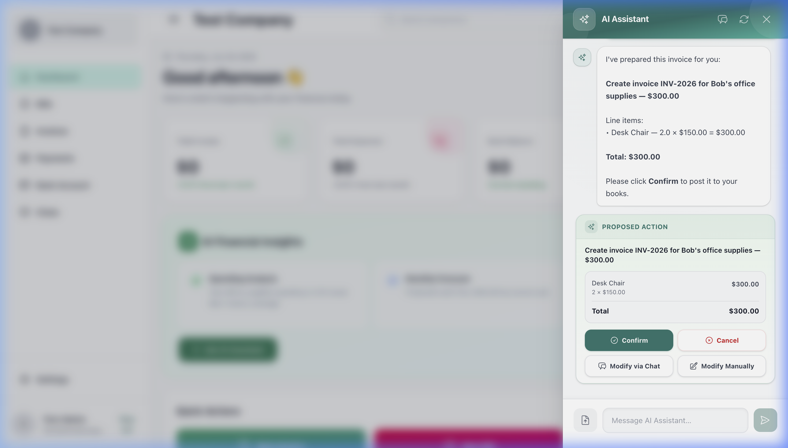
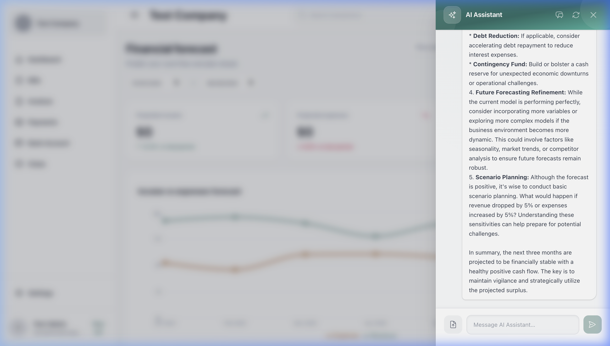
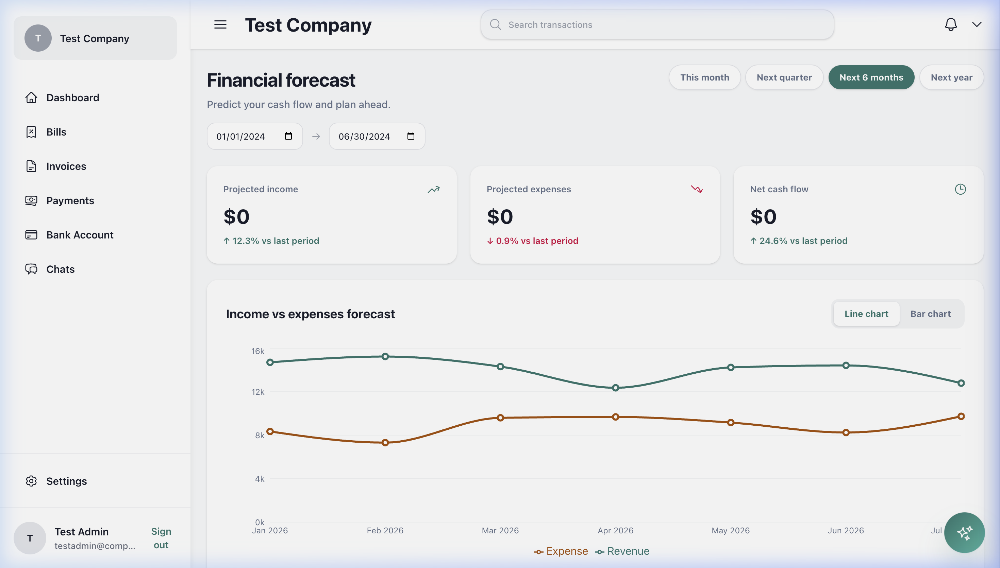
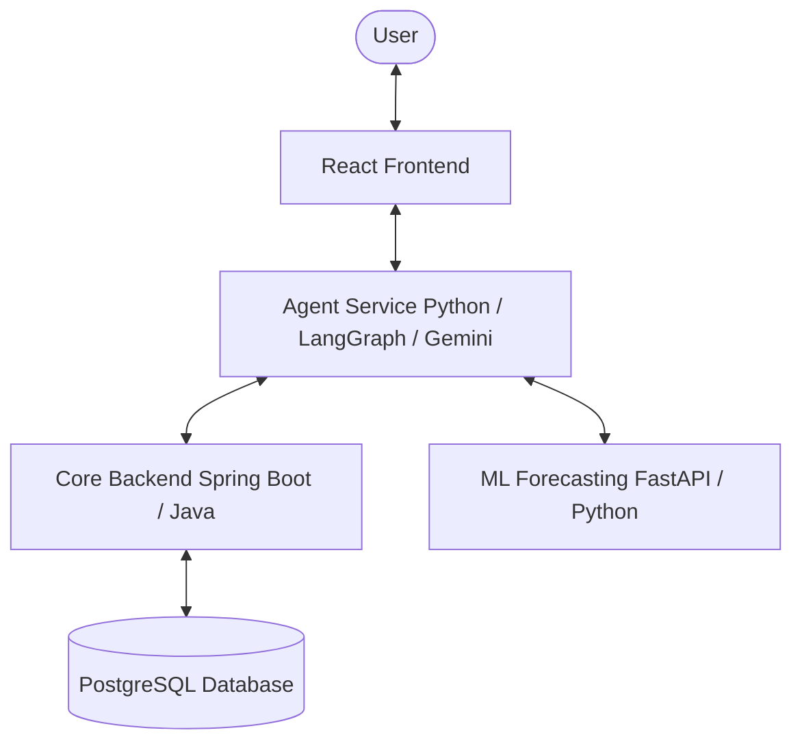

# FinFlow AI: Autonomous Multi-Agent Accounting Platform

FinFlow AI is an enterprise-grade, agentic accounting application that enables users to manage financial transactions (invoices, bills, chart of accounts) using natural language. 

The application utilizes a decoupled microservices architecture combining a reactive frontend, a robust Java/Spring Boot core backend, a Python ML forecasting engine, and a stateful Python agent service orchestrated using **LangGraph** and **Gemini**.

---

## 📸 Visual Previews

### 💬 Conversational Invoice Creation (Human-In-The-Loop)
*   **Description:** The AI assistant receives a natural language query to create an invoice. Instead of executing direct database writes, the agent runs a tool loop to resolve entities (matching names to client IDs) and returns a structured **Proposed Action** card. The user can review the line items and click **Confirm** to commit the record to Spring Boot.
*   **Screenshot:**
    

### 📊 Conversational Financial Analysis & Forecasting
*   **Description:** The AI assistant answers complex financial questions (e.g. *"Forecast our cash flow and analyze if sales exceed expenses"*). It queries the local ML forecasting service, evaluates historical and projected cash flows, and synthesizes natural language business insights and recommendations.
*   **Screenshot:**
    

### 📈 ML Cash Flow Forecasting Dashboard
*   **Description:** The analytics page displays historical actual revenues and expenses retrieved from the Spring Boot double-entry database, combined with a 6-month predictive projection curve calculated by the random forest/linear regression models in the FastAPI ML engine.
*   **Screenshot:**
    

---

## 🏗️ Architecture Overview

The system is structured as four distinct services to separate concerns, isolate workloads, and scale efficiently:



### Services Description
1. **Frontend (React):** A responsive user interface featuring real-time conversational chat, document uploads, financial statement dashboards, and human-in-the-loop validation checkpoints.
2. **Agent Service (FastAPI & LangGraph):** The conversational "brain" that classifies user intents, manages conversational state, executes autonomous tool calling, and packages proposed database operations.
3. **Core Backend (Spring Boot):** The transactional ledger system managing double-entry accounting records, customer/supplier directories, and financial security.
4. **ML Service (FastAPI):** A predictive analytical model designed to process historical transaction data and forecast expenses and account cash flows.

---

## ⚡ Technical Highlights

### 1. Stateful Multi-Agent Orchestration
We utilize **LangGraph** to model the accounting agent as a state-machine with specialized worker nodes:
* **Intent Routing:** A routing agent classifies requests to minimize context pollution and target specific agent nodes (`invoice_agent`, `expense_agent`, `analytics_agent`).
* **Tool-Calling Segregation:** Tools are bound only to the relevant agents (e.g. invoice search is only available to the invoice agent), reducing token overhead and preventing hallucinated tool triggers.

### 2. Human-In-The-Loop (HITL) Validation
For high-risk accounting operations (such as creating or deleting invoices), we enforce a structural **interrupt**. The agent does not execute database writes directly. Instead, it compiles a structured `ProposedAction` and halts execution, returning the draft payload to the React frontend for the user's explicit confirmation or modification before saving to Spring Boot.

### 3. Context Safety & Message Truncation
To prevent token explosion and stay within LLM context boundaries:
* **Summarize-then-Trim:** Older conversation logs are automatically condensed into a concise memory summary.
* **Orphan-Tool Protection:** Our message trimmer uses a walk-back algorithm to ensure we never separate an `AIMessage` requesting a tool from its corresponding `ToolMessage`, preventing LLM API crash loops (400 Bad Request).
* **Payload Limits:** Large database search payloads are automatically truncated when exceeding 8,000 characters before sending to the LLM.

### 4. API Resiliency & Key Rotation
To guarantee high availability and bypass API limits, the agent service wraps all model calls in a custom retry utility that automatically swaps Google API keys on-the-fly when encountering `429 Resource Exhausted` rate limit exceptions.

---

## 🛠️ Local Setup and Configuration

### Prerequisites
* Java 17+ & Maven
* Python 3.10+
* Node.js & npm
* PostgreSQL

### Database Setup
Execute the `supabase_schema.sql` file inside your SQL database client to initialize the double-entry accounting tables.

### 1. Core Backend (Spring Boot)
1. Navigate to `/Accounting` and duplicate `src/main/resources/application.properties.example` as `application.properties`.
2. Update database credentials.
3. Run the app:
```bash
./mvnw spring-boot:run
```

### 2. Agent Service (Python)
1. Navigate to `/agent-service` and create a `.env` file:
```env
GOOGLE_API_KEYS="your-first-gemini-key,your-second-gemini-key"
SPRING_BOOT_BASE_URL="http://localhost:8080"
```
2. Set up virtual environment and run:
```bash
python -m venv venv
source venv/bin/activate
pip install -r requirements.txt
python main.py
```

### 3. React Frontend
1. Navigate to `/frontend` and run:
```bash
npm install
npm run dev
```
